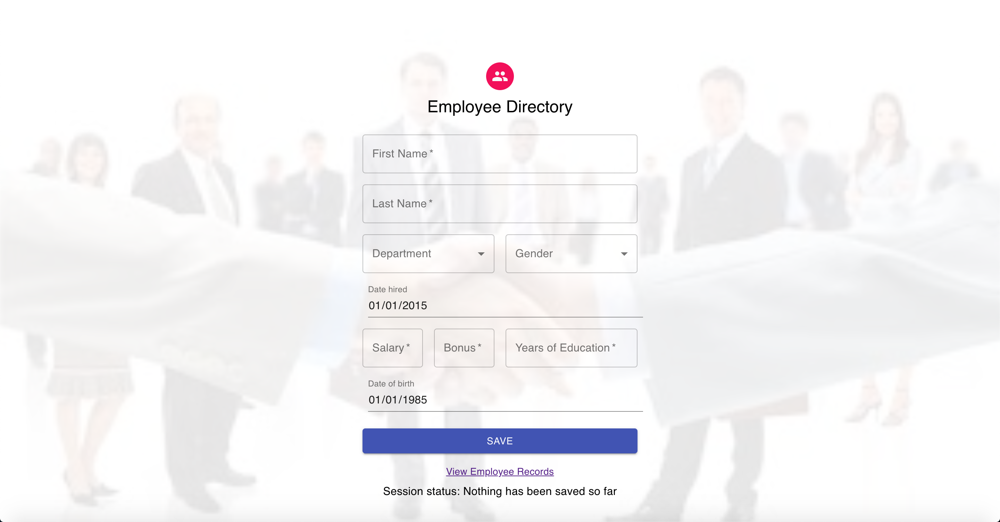
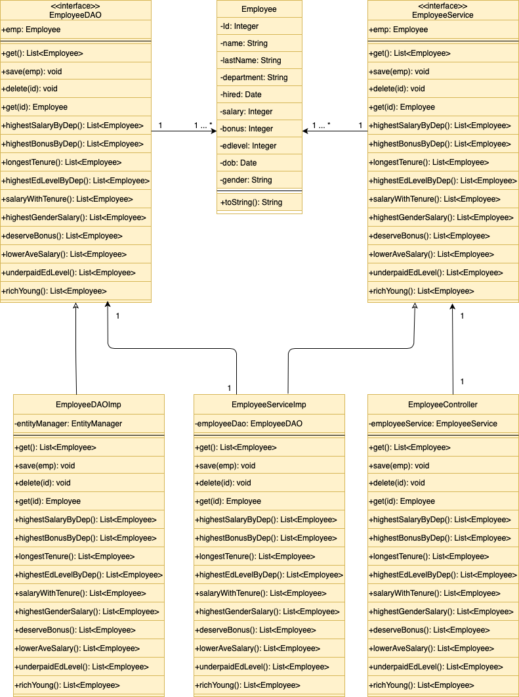

University Name: San Jose State University

Course: Enterprise Software - CMPE 172 Spring 2020

Team Members: Joshua Gendein, Nicholas Hsiao, Aliaksandr Nenartovich

Project Description and Introduction: This application is designed to be used by authenticated and authorized HR managers of large companies in order to store, manage and modify the records of employees currently working in the company. Application enables HR managers to view all employees currently in the database, add new employee records, search for specific employees as well as update or delete existing employee records from the database. Additionally, this application provides a basic analytics functionality which allows HR managers to see certain trends and patterns within the company. Sample analytical data available in the application includes displaying employees with highest salaries in each department, highest salaries among male and female workers, employees with lower salaries than the average salary in their department etc.

Sample demo screenshots of SmartForm are presented below:

Prerequisites for set up:
For using the application on public URL simply go to:

http://smartform-env.eba-emp4nwip.us-east-1.elasticbeanstalk.com/

Prerequisites for running the application locally:
1) Java installed on your computer
2) Node JS installed on your computer
3) Docker desktop installed (optional) if you wish to run the application in the Docker container
4) Eclipse IDE installed with the plug-in for Spring Boot

Instructions on how to run the project locally:

Clone this repository. In Eclipse or Spring IDE create a new Spring starter project and import the cloned repository into your project. Make sure you choose a Maven project option.

Instructions on running without Docker:
Open Eclipse or Spring IDE and locate the project you have imported. Right click on the project, choose Run as -> SpringBoot App. Wait for server to start. Open the browser, go to localhost:8085 and you should see the home page of the application. Some Node dependencies may need to be installed.

Instructions on how to run inside the Docker container:
Download and install Docker. In Eclipse of Spring IDE, right-click on this project name that you imported, choose Run as -> Maven Build... type "package" in a pop-up window, click Run. It'll take a minute or so for Maven to create a jar file. Create a folder anywhere in your system and call it Docker. Move the created jar file into the Docker folder. Also, locate a file called Dockerfile, move it to Docker folder also. Open Terminal, navigate to the Docker folder and run the following command:

docker build -f Dockerfile -t smart-form . (Note: put that last period there - it mean "use current folder"). 

Wait while Docker will download all necessary dependencies. Once docker image is created, in Terminal run (from anywhere): 

docker run -p 8085:8085 smart-form

Open your browser, go to localhost:8085 , you should see the application Home page there. 

The class diagram of the system is presented below:

The sequence diagram of the system is presented as follows:

Database schema of the project is presented in the screenshot below:

The following is the list of database queries used in the project (note: model class Employee has been replaced with database table name tb_emp):

SELECT * FROM tb_emp;

SELECT * from tb_emp WHERE (department, salary) in 
		  	                (SELECT department, MAX(salary) FROM tb_emp 
		  	                         GROUP BY department) ORDER BY salary DESC;

SELECT * FROM tb_emp WHERE (department, bonus) in  
		  	                (SELECT department, MAX(bonus) FROM tb_emp
		  	                         GROUP BY department) ORDER BY bonus DESC;

SELECT * FROM tb_emp WHERE (department, hired) in 
	  	                    (SELECT department, MIN(hired) FROM tb_emp
	  	                             GROUP BY department) ORDER BY hired ASC;

SELECT * FROM tb_emp WHERE (department, edlevel) in
		  	                (SELECT department, MAX(edlevel) FROM tb_emp
		  	                         GROUP BY department) ORDER BY edlevel DESC;

SELECT * FROM tb_emp WHERE hired < DATE_SUB(CURDATE(), INTERVAL 5 YEAR) ORDER BY salary DESC;

SELECT * FROM tb_emp WHERE (gender, salary) in
		  	                (SELECT gender, MAX(salary) FROM tb_emp
		  	                         GROUP BY gender) ORDER BY salary DESC;

SELECT * FROM tb_emp WHERE hired < DATE_SUB(CURDATE(), INTERVAL 5 YEAR) 
		  	                                    AND bonus = 0 
		  	                                    ORDER BY hired ASC;

SELECT * FROM tb_emp E1 WHERE salary < 
						(select AVG(salary) FROM tb_emp WHERE department = E1.department)
		  	                                                  ORDER BY salary ASC;

SELECT * FROM tb_emp WHERE edlevel >= 5 AND salary < 60000 ORDER BY salary ASC;

SELECT * FROM tb_emp WHERE dob > DATE_SUB(CURDATE(), INTERVAL 30 YEAR)
		  	                                         AND salary > 80000
		  	                                         ORDER BY salary DESC;

The following mid tier APIs were used in this project:

List<Employee> get();
Employee get(int id);
void save(Employee employee);
void delete(int id);
List<Employee> highestSalaryByDep();
List<Employee> highestBonusByDep();
List<Employee> longestTenure();
List<Employee> highestEdLevelByDep();
List<Employee> salaryWithTenure();
List<Employee> highestGenderSalary();
List<Employee> deserveBonus();
List<Employee> lowerAveSalary();
List<Employee> underpaidEdLevel();
List<Employee> richYoung();

In order to transport data to UI, the project uses the following mechanism:

After database is queried, the list of Java Employee objects is retrieved and sent to a specified endpoint. The client side retrieves the list from the endpoint, converts it to JSON format and stores it in a local state variable after which point data is displayed on the client page in a desired format (in our case, SmartForm uses a Material UI table to display data). 

If you have any question please do not hesitate to contact us at: aliaksandr.nenartovich@sjsu.edu